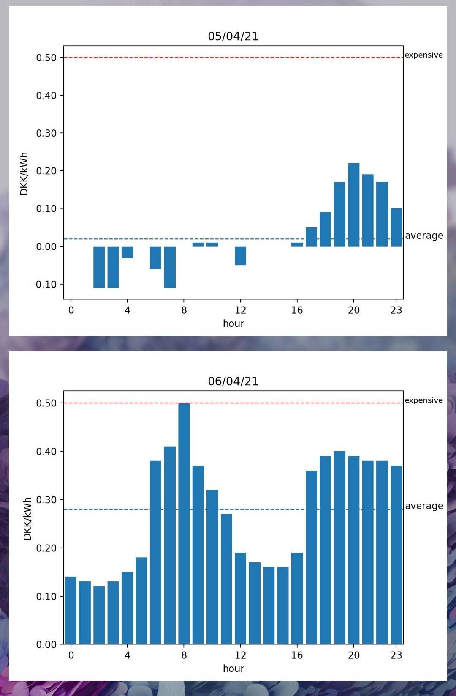
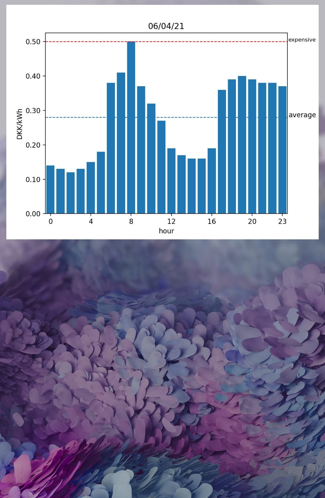

# Electricity Price Widget for Android

Android widget for viewing electricity prices for today and tommorow for eastern Denmark.

Shows nothing if no prices for tomorrow yet.

Updates every 2 hours or by tapping anywhere on the widget.

Uses my  to download and display prices. 

Also contains a deprecated main activity which tries to render an electricity price graph itself.
